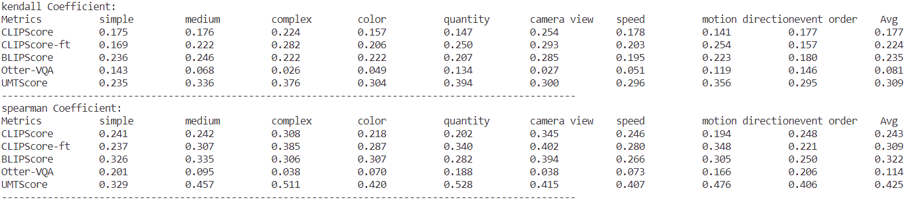

# FETV_eval
This repo describes how to reproduce the evaluation results in the [FETV paper](https://arxiv.org/abs/2311.01813).  
If you only want to evaluate a new text-to-video (T2V) generation model using the [FETV](https://github.com/llyx97/FETV) benchmark and UMT-based metrics, please refer to the folder [UMT](https://github.com/llyx97/FETV_eval/tree/main/UMT).

## 1. Video Collection
### 1.1 Collect Generated Videos
We evaluate four T2V models: [CogVideo](https://github.com/THUDM/CogVideo/), [Text2Video-Zero](https://github.com/Picsart-AI-Research/Text2Video-Zero), [ModelScopeT2V](https://modelscope.cn/models/damo/text-to-video-synthesis/summary) and [ZeroScope](https://huggingface.co/cerspense/zeroscope_v2_576w).	

The generated videos and processed video frames are provided in this [huggingface dataset](https://huggingface.co/datasets/lyx97/FETV_gen_videos). Download them to `datas/videos`

The folder is structured as follows:
```
datas/videos
	├── cogvideo
	│   ├── videos
	│   └── 16frames_uniform   
	├── cogvideo_fid
	├── text2video-zero
	├── text2video-zero_fid
	├── modelscope-t2v
	├── modelscope-t2v_fid
	├── zeroscope
	└── zeroscope_fid
```
`cogvideo/videos` contains 619 videos generated from the prompts in `datas/fetv_data.json`. `cogvideo/16frames_uniform` contains uniformly sampled frames of the videos. `cogvideo_fid` contains 2,055 videos generated from the prompts in `datas/sampled_prompts_for_fid_fvd/prompts_gen.json`, which is used to compute FID and FVD.

<details>
<summary>If you want to generate the videos yourself, follow these steps:</summary>

### Generate and Process Videos
* Enter the corresponding folder and install the environment and download the models as the README file instructed. Then, run `bash run.sh`.  
* By default, the input prompt file is the original FETV data file placed in the `datas` folder of every T2V model. To generate videos for computing FID and FVD, change the input file path in `run.sh` to `datas/prompts_gen.json` (for Text2Video-Zero, ModelScopeT2V and ZeroScope) or `datas/prompts_gen_cn.txt` (for CogVideo).
* To process the generated videos (".mp4" or ".gif") into frames of ".jpg" files, run
```
python utils/video2frames.py \
--video_ext .mp4 \
--frm_num 16 \
--video_root_path $path/to/the/generated/videos$ \
--target_root_path $path/to/the/processed/frames$ \
--sampling_strategy uniform
```
To compute CLIPScore, BLIPScore and FID, we adopt the "uniform" frame sampling strategy. To compute FVD, we adopt the "offset" frame sampling strategy following [stylegan-v](https://kaust-cair.s3.amazonaws.com/stylegan-v/stylegan-v-paper.pdf).	
The processed frames are structured as follows:
```
path_of_processed_frames
	├── sent0
	│   ├── frame0.jpg
	│   ├── frame1.jpg
	|   ...
	|   └── frame15.jpg   
	├── sent1
	...
	└──  sent618
```
</details>
  

### 1.2 Collect Reference Real Videos
* Download the real videos from MSR-VTT using the [script](https://github.com/jayleicn/ClipBERT/blob/main/scripts/download_msrvtt.sh) provided by [ClipBERT](https://github.com/jayleicn/ClipBERT) and then copy them to `real_videos` using `utils/collect_real_video.py`.
* Download the real videos from WebVid to `real_videos` using the script `utils/collect_real_video.py`.
* Cut some videos using the script `utils/cut_video.py`.
* To collect the real videos for computing FID and FVD, run the script `utils/collect_real_video.py` (change the video_id_file from `datas/fetv_data.json` to `datas/sampled_prompts_for_fid_fvd/prompts_real.json`.). The videos will be saved to `datas/videos/real_videos_fid`.
  
**NOTE**: You can also contact liuyuanxin@stu.pku.edu.cn to access the reference real videos.


## 2. Manual Evaluation
The manual evaluation results from three human evaluators can be found in `manual_eval_results`. By running `python utils/visualization_manual_results.py`, these results can be visualized in the form of radar plots:	

**Results of static and temporal video quality**


**Results of video-text alignment**


We also release our [manual evaluation instruction](https://drive.google.com/file/d/1bqeuOIhZ2YJdqfNr3B1azNXXs5tRSncg/view?usp=sharing) with carefully designed rating level definitions and examples. We hope this can help facilitate inter-human correlation in evaluating T2V generation models.

## 3. Automatic Evaluation
### 3.1 Video-Text Alignment
#### 3.1.1 CLIPScore and BLIPScore
Run the following command to compute CLIPScore and BLIPScore:
```
  python auto_eval.py \
  	--eval_model ViT-B/32 \
  	--blip_config BLIP/blip_config.yaml \
  	--prompt_file datas/fetv_data.json \
  	--gen_path datas/videos/modelscope-t2v/16frames_uniform \
    	--t2v_model modelscope-t2v \
	--is_clip_ft false \
  	--save_results true 
```
- `--gen_path`: The path containing a T2V model's generated videos, processed into frames of images
- `--eval_model`: The model used to compute CLIPScore. By default, the original [ViT-B/32](https://openaipublic.azureedge.net/clip/models/40d365715913c9da98579312b702a82c18be219cc2a73407c4526f58eba950af/ViT-B-32.pt) CLIP model is used. To compute CLIPScore-ft, please set `--eval_model` to the path of the fine-tuned CLIP checkpoint on MSR-VTT (we follow the implementation from [CLIP4CLIP](https://github.com/ArrowLuo/CLIP4Clip#msrvtt)). Note: the checkpoint should be converted via `utils/transform_ckpt.py` before computing CLIPScore-ft.
- `--t2v_model`: The name of the text2video generation model, used to name the result file.
- `--is_clip_ft`: Whether to use the fine-tuned CLIP model, set to 'true' when computing CLIPScore-ft.
- The results will be saved to `auto_eval_results/CLIPScore` and `auto_eval_results/BLIPScore`.

#### 3.1.2 UMTScore
Please refer to the folder [UMT](https://github.com/llyx97/FETV_eval/tree/main/UMT) for how to compute the UMTScore.

#### 3.1.3 Correlation between Automatic Metrics and Humans
To compute the correlation between automatic and human judgements of video-text alignment, run
```
  python auto_human_correlation.py
```
The results will be printed as follows:


### 3.2 Video Quality
#### 3.2.1 FID

To compute FID, run
```
  python compute_fid.py \
    --model modelscope-t2v \
    --fg_fid
```
- `--model` determines which T2V generation model to evaluate.
- `--fg_fid` determines whether to compute fine-grained FID of different categories (e.g., people, animals) or over the entire FETV benchmark.
   
The results will be saved to `auto_eval_results/fid_results` and `auto_eval_results/fid_fg_results`, respectively.

#### 3.2.2 FVD

To compute FVD over the entire FETV benchmark, enter the folder `stylegan-v` and run 
```
    bash run_fvd_modelscope-t2v.sh
``` 
Change `modelscope-t2v` to evaluate different T2V generation models. The results will be saved to `auto_eval_results/fvd_results`.

To compute FVD of different categories, run
```
    python compute_fg_fvd.py \
      --model modelscope-t2v
```
- `--model` determines which T2V generation model to evaluate.
  
The results will be saved to `auto_eval_results/fvd_fg_results`.

#### 3.2.3 FVD-UMT
Please refer to the folder [UMT](https://github.com/llyx97/FETV_eval/tree/main/UMT) for how to compute the FVD-UMT.

#### 3.2.4 Correlation between Automatic Metrics and Humans
To visualize the automatic and human ranking of T2V models in terms of video quality, run
```
    python plot_fid_fvd_human.py
```


To visualize the fine-grained results in different categories, run
```
    python plot_fid_fvd_human_fg.py
```
To visualize the effect of video sample number on FID and FVD, run
```
    python plot_fid_fvd_numvideo.py
```
